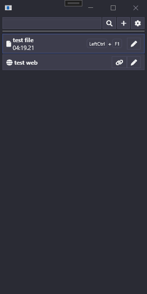

# Description

WPF soundboard used to play sound on any audio peripheral.

Features :
- Global system hotkeys
- Save sounds with differents volumes
- Allow to play a sound multiples times at once
- Allow to play sound directly from a link

Created with :
- Adonis UI (WPF theme and styles)
- NAudio (playing audio)